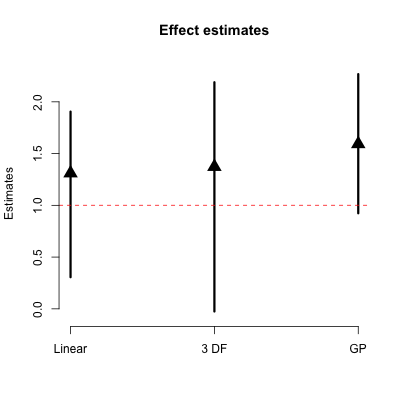
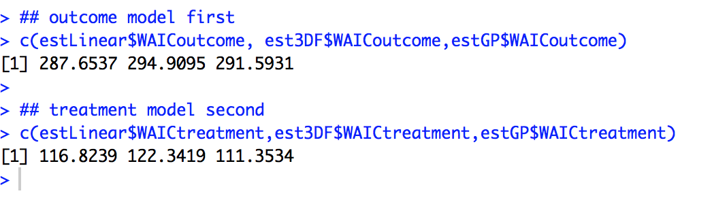
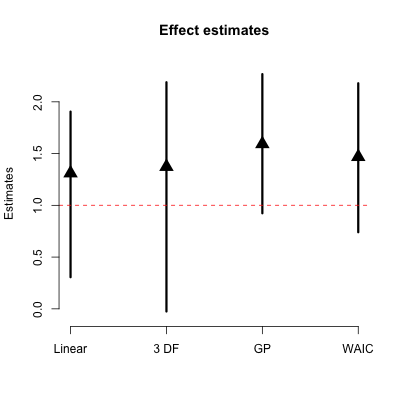
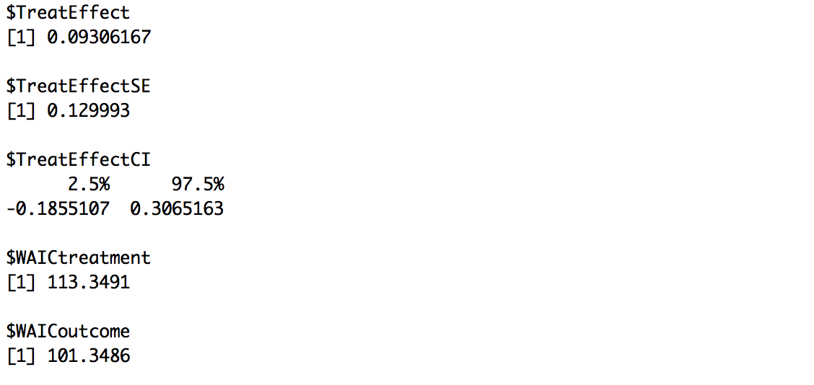
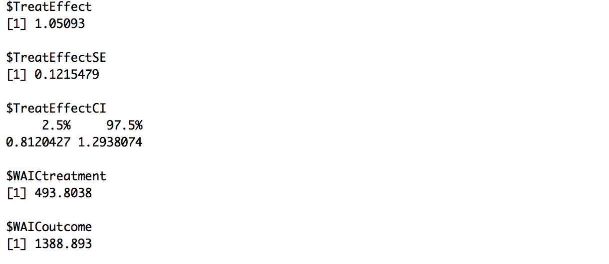

# DoublyRobustHD
This is an R package to implement methods seen in "A Bayesian semiparametric framework for causal inference in high-dimensional data" by Joseph Antonelli and Francesca Dominici, which can be found at the following link:

https://arxiv.org/pdf/1805.04899.pdf

To download the R package use the following in R:


```
library(devtools)
install_github(repo = "jantonelli111/DoublyRobustHD")
library(DoublyRobustHD)
```

# How to use the software

As a first step for using the R package, we will look at the case where we have a binary treatment, and we are interested in the average treatment effect. Below we simulate some data under this scenario.

```{r, eval=FALSE}
n = 200
p = 200
x = matrix(rnorm(n*p), n, p)
t = rbinom(n, 1, p=pnorm(0.7*x[,1] + 0.3*x[,2]))
y = rnorm(n, mean=t + 0.3*x[,1] + 0.6*x[,2] + 0.5*x[,3], sd=1)
```

Now we will illustrate how to implement our doubly robust estimator under three different amounts of flexibility for the treatment and outcome models. We will model the effect of the covariates on the treatment/outcome with linear functions, 3 degree of freedom splines, and Gaussian processes:

```{r, eval=FALSE}
estLinear = DRbayes(y=y, t=t, x=x, nScans=2000, nBurn=1000, thin=2)
est3DF = DRbayes(y=y, t=t, x=x, nScans=2000, nBurn=1000, thin=2, dfY=3, dfT=3)
estGP = DRbayes(y=y, t=t, x=x, nScans=2000, nBurn=1000, thin=2, dfY="GP", dfT="GP")
```

A couple of things to note here. We are running 2000 MCMC scans where we are burning the first 1000 and keeping every other scan. These parameters do not need to be specified, as they have default settings. The dfY and dfT parameters control the amount of flexibility assumed in the modeling process. A value of 1 implies linear functions, while higher numbers represent more degrees of freedoms in a spline. The most flexible option is setting these parameters to "GP" and they are modeled using Gaussian processes. First let's look at the estimates of the treatment effect and credible intervals for the three estimators:

```{r, eval=FALSE}
estimates = c(estLinear$TreatEffect, est3DF$TreatEffect, estGP$TreatEffect)
CIlower = c(estLinear$TreatEffectCI[1], est3DF$TreatEffectCI[1], estGP$TreatEffectCI[1])
CIupper = c(estLinear$TreatEffectCI[2], est3DF$TreatEffectCI[2], estGP$TreatEffectCI[2])

## plot effect estimates
plot(1:3, estimates, pch=17, cex=2, ylim = range(c(CIlower, CIupper)) + c(-0.05, 0.05),
     xlab="", ylab="Estimates", axes=FALSE, main="Effect estimates")
segments(x0 = 1:3, x1=1:3, y0=CIlower, y1=CIupper, lwd=3)
abline(h = 1, lty=2, col="red")
axis(2)
axis(1, at=1:3, c("Linear", "3 DF", "GP"))
```



Now, we know that the linear model is the correct model in this case, though normally we won't have this knowledge. We could play it safe and simply choose a flexible model every time, or we could look at the WAIC of each model, and find the best treatment and outcome models

```{r, eval=FALSE}
## outcome model first
c(estLinear$WAICoutcome, est3DF$WAICoutcome,estGP$WAICoutcome)

## treatment model second
c(estLinear$WAICtreatment,est3DF$WAICtreatment,estGP$WAICtreatment)
```



So in this case we can see that the linear model is best for the outcome, but the GP model is best for the treatment, so we can fit a model using the best treatment and outcome model (according to WAIC)

```{r, eval=FALSE}
estWAIC = DRbayes(y=y, t=t, x=x, nScans=200, nBurn=100, thin=2, dfY=1, dfT="GP")
```

And then plot the results

```{r, eval=FALSE}
estimates = c(estLinear$TreatEffect, est3DF$TreatEffect, 
              estGP$TreatEffect, estWAIC$TreatEffect)
CIlower = c(estLinear$TreatEffectCI[1], est3DF$TreatEffectCI[1], 
            estGP$TreatEffectCI[1], estWAIC$TreatEffectCI[1])
CIupper = c(estLinear$TreatEffectCI[2], est3DF$TreatEffectCI[2], 
            estGP$TreatEffectCI[2], estWAIC$TreatEffectCI[2])

## plot effect estimates
plot(1:4, estimates, pch=17, cex=2, ylim = range(c(CIlower, CIupper)) + c(-0.05, 0.05),
     xlab="", ylab="Estimates", axes=FALSE, main="Effect estimates")
segments(x0 = 1:4, x1=1:4, y0=CIlower, y1=CIupper, lwd=3)
abline(h = 1, lty=2, col="red")
axis(2)
axis(1, at=1:4, c("Linear", "3 DF", "GP", "WAIC"))
```



And that is how differing amounts of flexibility are accounted for. For the rest of the vignette we will talk about other issues, such as categorical covariates, binary outcomes, or continuous treatments. It is important to note, however, that the flexibility of the respective models is handled the same way in all of these different situations and therefore from here on we will restrict to 2 degree of freedom splines for simplicity.

## Binary outcomes

Now let's simulate data from a binary outcome

```{r, eval=FALSE}
n = 200
p = 20
x = matrix(rnorm(n*p), n, p)
t = rbinom(n, 1, p=pnorm(0.7*x[,1] + 0.3*x[,2]))
y = rbinom(n, 1, pnorm(0.5*t + 0.7*x[,1] + 0.9*x[,2] + 0.75*x[,3]))
```

Now the only difference in the function to estimate the treatment effects is to use the argument, y_type as follows:

```{r, eval=FALSE}
est = DRbayes(y=y, t=t, x=x, nScans=2000, nBurn=1000, 
              thin=2, dfY=2, dfT=2, y_type="binary")

print(est)
```



## categorical covariates

Our R package handles categorical covariates differently than continuous ones because we obviously wouldn't want to model the effect of a categorical covariate using splines or Gaussian processes. Instead we will simply use indicators for each level of the categorical covariate, with the exception of the reference category. With this in mind, we have an argument called whichCat, in which the users can specify which variables are categorical in the data set. If the users do not specify anything for this argument then all covariates will be assumed to be continuous, and the function may error. Another important point is that if a covariate has more than $k > 2$ categories, do not make separate columns in the design matrix for each of the $k-1$ indicator functions. Simply leave the single column that has multiple categories and our software will make the indicator functions themselves. The reason this is important is because we put spike and slab priors on all parameters for a given covariate jointly, but if you separate them before using the software, it will treat them as separate covariates and they will have separate spike and slab priors. Below we simulate an example:

```{r, eval=FALSE}
n = 200
p = 200
x = matrix(rnorm(n*p), n, p)

## make the first covariate binary
x[,1] = rbinom(n, 1, 0.5)

## and the second covariate have 3 categories
x[,2] = sample(1:3, n, replace=TRUE)

t = rbinom(n, 1, p=pnorm(0.7*x[,1] + 0.3*(x[,2] == 2) + 0.5*(x[,2] == 3)))
y = rnorm(n, mean=t + 0.3*x[,1] + 0.5*(x[,2] == 2) + 
            0.8*(x[,2] == 3) + 0.5*x[,3], sd=1)

```

Now we can estimate it using the following code, where we indicate that both the first and second covariates are categorical.

```{r, eval=FALSE}
est = DRbayes(y=y, t=t, x=x, nScans=200, nBurn=100, thin=2, 
              whichCat = c(1,2), dfT=2, dfY=2)
              
print(est)
```



## Continuous treatments

The last topic to consider now is the estimation of treatment effects with continuous treatments. Here, we will be estimating 

```{r, eval=FALSE}
n = 200
p = 20
x = matrix(rnorm(n*p), n, p)
t <- 0.6*x[,1] + 0.6*x[,2] + rnorm(n)
y <- 5 + 0.05*t^3 - 0.1*t^2 + 0.5*x[,1] + 0.5*x[,2] + rnorm(n)

est = DRbayesER(y=y, t=t, x=x, nScans=2000, nBurn=1000, thin=2)

plot(est$TreatEffect, type='l', lwd=2, ylim=c(2,9))
lines(est$TreatEffectCI[,1], lwd=2, lty=2)
lines(est$TreatEffectCI[,2], lwd=2, lty=2)
```

**References**

Joseph Antonelli, and Francesca Dominici. **A Bayesian semiparametric framework for causal inference in high-dimensional data**. 2018. arXiv:1805.04899


